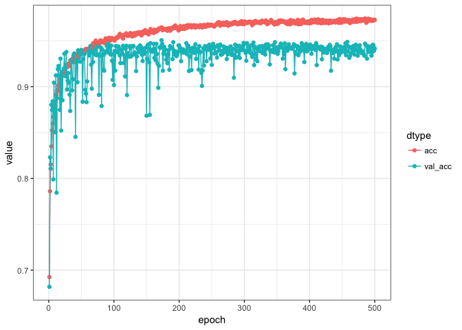
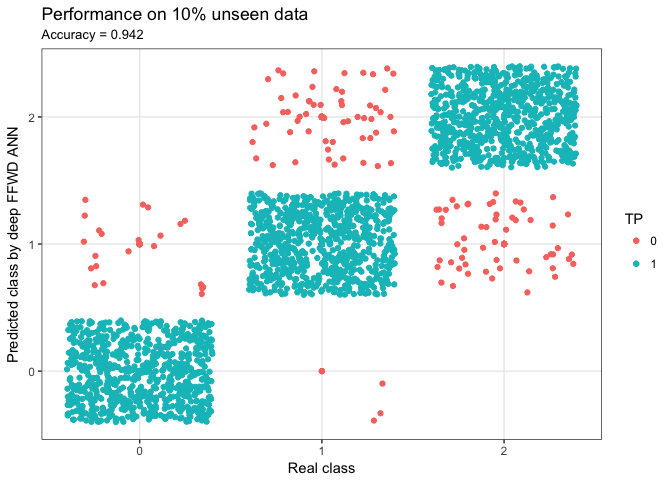

<!-- README.md is generated from README.Rmd. Please edit that file -->

Have no fear, you're almost there!
==================================

We need a few things installed before we're good to go, but I promise it'll be quick and painless!

Getting started
---------------

You only need to do the following once!

Go ahead and head on over to [The R Project for Statistical Computing](https://www.r-project.org/) and install the newest version of `R`. Then pop over to [RStudio](https://www.rstudio.com/products/rstudio/download/#download) and get their brilliant IDE.

In order to use `Keras` and `TensorFlow`, we need to install them along with the `TidyVerse` framework. Since we're working with peptides in this example, we also need the `ggseqlogo` package for generating sequence logos. Fortunately this is straight forward using `devtools`:

``` r
install.packages("devtools")
```

Now we load the `devtools` library, which will enable us to install the remaining requirements:

``` r
library("devtools")
```

and then install requirements

``` r
install.packages("tidyverse")
devtools::install_github("rstudio/keras")
devtools::install_github("omarwagih/ggseqlogo")
devtools::install_github("leonjessen/PepTools")
```

and then simply run

``` r
library("keras")
```

Followed by

``` r
install_keras()
```

That's it! Now we have all we need to be masters of the universe!

Deep Feed Forward Artificial Neural Network
===========================================

Here is a basic example of a deep FFWD ANN workflow (This example is adapted from this [RStudio Keras](https://keras.rstudio.com/) tutorial).

First we clear the workspace to avoid unintentional reuse of old variables

``` r
rm(list=ls())
```

Then we load the needed libraries

``` r
library("keras")
library("tidyverse")
#> ── Attaching packages ──────────────────────────────────────────────────────────── tidyverse 1.2.1 ──
#> ✔ ggplot2 2.2.1     ✔ purrr   0.2.4
#> ✔ tibble  1.3.4     ✔ dplyr   0.7.4
#> ✔ tidyr   0.7.2     ✔ stringr 1.2.0
#> ✔ readr   1.1.1     ✔ forcats 0.2.0
#> ── Conflicts ─────────────────────────────────────────────────────────────── tidyverse_conflicts() ──
#> ✖ dplyr::filter() masks stats::filter()
#> ✖ dplyr::lag()    masks stats::lag()
library("ggseqlogo")
library("PepTools")
```

Then we load the example data

``` r
pep_file = "https://raw.githubusercontent.com/leonjessen/keras_tensorflow_demo/master/data/ran_peps_netMHCpan40_predicted_A0201_reduced_cleaned_balanced.tsv"
pep_dat = read_tsv(file = pep_file)
#> Parsed with column specification:
#> cols(
#>   peptide = col_character(),
#>   label_chr = col_character(),
#>   label_num = col_integer(),
#>   data_type = col_character()
#> )
```

The example peptide data looks like this

``` r
pep_dat
#> # A tibble: 23,760 x 4
#>      peptide label_chr label_num data_type
#>        <chr>     <chr>     <int>     <chr>
#>  1 LLTDAQRIV        WB         1     train
#>  2 LMAFYLYEV        SB         2     train
#>  3 VMSPITLPT        WB         1      test
#>  4 SLHLTNCFV        WB         1     train
#>  5 RQFTCMIAV        WB         1     train
#>  6 HQRLAPTMP        NB         0     train
#>  7 FMNGHTHIA        SB         2     train
#>  8 KINPYFSGA        WB         1     train
#>  9 WLLIFHHCP        NB         0     train
#> 10 NIWLAIIEL        WB         1     train
#> # ... with 23,750 more rows
```

We can use TidyVerse methods to summarise the input data

``` r
pep_dat %>% group_by(label_chr, data_type) %>% summarise(n = n())
#> # A tibble: 6 x 3
#> # Groups:   label_chr [?]
#>   label_chr data_type     n
#>       <chr>     <chr> <int>
#> 1        NB      test   782
#> 2        NB     train  7138
#> 3        SB      test   802
#> 4        SB     train  7118
#> 5        WB      test   792
#> 6        WB     train  7128
```

Or use the ggseqlogo package to visualise the sequence motif for the strong binders

``` r
pep_dat %>% filter(label_chr=='SB') %>% pull(peptide) %>% ggseqlogo()
```


Prepare data
------------

We need to define the `x_train`, `y_train`, `x_test` and `y_test`

``` r
x_train = pep_dat %>% filter(data_type == 'train') %>% pull(peptide) %>% pep_encode
y_train = pep_dat %>% filter(data_type == 'train') %>% pull(label_num) %>% array
x_test  = pep_dat %>% filter(data_type == 'test') %>% pull(peptide) %>% pep_encode
y_test  = pep_dat %>% filter(data_type == 'test') %>% pull(label_num) %>% array
```

The x data is a 3-d array: ‘total \#peptides’ x ‘length of each peptide (9)’ x ‘\#unique residue (20)’ To prepare the data for training we convert the 3-d arrays into matrices by reshaping width and height into a single dimension (9x20 peptide ‘images’ are flattened into vectors og lengths 180)

``` r
dim(x_train) = c(nrow(x_train), dim(x_train)[2] * dim(x_train)[3])
dim(x_test)  = c(nrow(x_test), dim(x_test)[2] * dim(x_test)[3])
```

The y data is an integer vector with values ranging from 0 to 2. To prepare this data for training we encode the vectors into binary class matrices using the Keras to\_categorical() function:

``` r
y_train = to_categorical(y_train, y_train %>% table() %>% length)
y_test  = to_categorical(y_test, y_test %>% table() %>% length)
```

Defining the model
------------------

The core data structure of Keras is a model, a way to organize layers. The simplest type of model is the Sequential model, a linear stack of layers. We begin by creating a sequential model and then adding layers using the pipe (%&gt;%) operator:

``` r
model = keras_model_sequential() 
model %>% 
  layer_dense(units  = 180, activation = 'relu', input_shape = c(180)) %>% 
  layer_dropout(rate = 0.4) %>% 
  layer_dense(units  = 90, activation  = 'relu') %>%
  layer_dropout(rate = 0.3) %>%
  layer_dense(units  = 3, activation   = 'softmax')
```

The input\_shape argument to the first layer specifies the shape of the input data (a length 180 numeric vector representing a peptide 'image'). The final layer outputs a length 3 numeric vector (probabilities for each class `SB`, `WB` and `NB`) using a softmax activation function.

We can use the summary() function to print the details of the model:

``` r
summary(model)
#> ___________________________________________________________________________
#> Layer (type)                     Output Shape                  Param #     
#> ===========================================================================
#> dense_1 (Dense)                  (None, 180)                   32580       
#> ___________________________________________________________________________
#> dropout_1 (Dropout)              (None, 180)                   0           
#> ___________________________________________________________________________
#> dense_2 (Dense)                  (None, 90)                    16290       
#> ___________________________________________________________________________
#> dropout_2 (Dropout)              (None, 90)                    0           
#> ___________________________________________________________________________
#> dense_3 (Dense)                  (None, 3)                     273         
#> ===========================================================================
#> Total params: 49,143
#> Trainable params: 49,143
#> Non-trainable params: 0
#> ___________________________________________________________________________
```

Next, compile the model with appropriate loss function, optimizer, and metrics:

``` r
model %>% compile(
  loss = 'categorical_crossentropy',
  optimizer = optimizer_rmsprop(),
  metrics = c('accuracy')
)
```

Training and evaluation
-----------------------

We use the fit() function to train the model for 500 epochs using batches of 50 peptide ‘images’:

``` r
history = model %>% fit(
  x_train, y_train, 
  epochs = 500, batch_size = 50,
  validation_split = 0.2
)
```

Visualise training
------------------

We can visualise the training progress in each epoch using `ggplot`:

``` r
plot_dat = tibble(epoch = rep(1:history$params$epochs,2),
                  value = c(history$metrics$acc,history$metrics$val_acc),
                  dtype = c(rep('acc',history$params$epochs),
                            rep('val_acc',history$params$epochs)) %>% factor)
plot_dat %>%
  ggplot(aes(x=epoch,y=value,colour=dtype)) +
  geom_point() +
  geom_line() +
  theme_bw()
```



Performance
-----------

Finally we can evaluate the model’s performance on the original ~10% left out test data:

``` r
model %>% evaluate(x_test, y_test)
#> $loss
#> [1] 0.2083408
#> 
#> $acc
#> [1] 0.9419192
```

and we can visualise the predictions:

``` r
y_pred  = model %>% predict_classes(x_test)
y_real  = y_test %>% apply(1,function(x){ return( which(x==1) - 1) })
results = tibble(y_real = y_real, y_pred = y_pred, TP = ifelse(y_real == y_pred,1,0) %>% factor)
acc     = as.numeric(as.character(results$TP)) %>% mean %>% round(3)
results %>%
  ggplot(aes(x=y_real,y=y_pred,colour=TP)) +
  geom_point() +
  xlab("Real class") +
  ylab("Predicted class by deep FFWD ANN") +
  ggtitle(label = "Performance on 10% unseen data",
          subtitle = paste("Accuracy =",acc)) +
  scale_x_continuous(breaks = c(0,1,2), minor_breaks = NULL) +
  scale_y_continuous(breaks = c(0,1,2), minor_breaks = NULL) +
  geom_jitter() +
  theme_bw()
```



That the end of this small tutorial - I hope you had fun!
