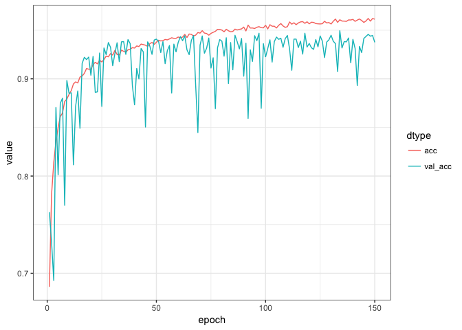
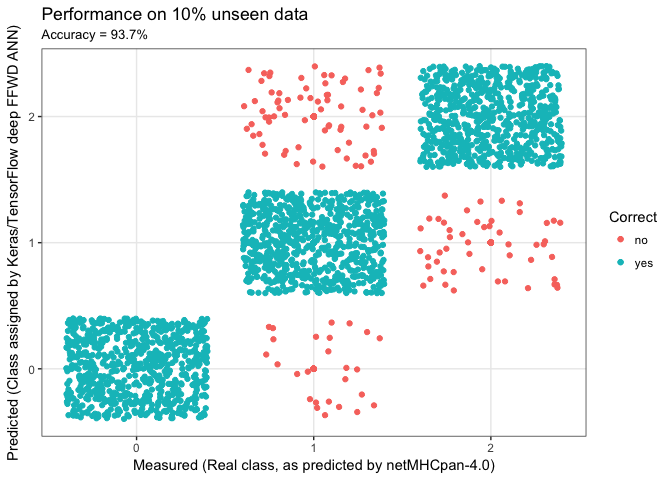

Keras/TensorFlow in R Demo with Immunoinformatics as use-case
================

Click on each section to expand or jump directly to the section of interest

Introduction
============

<details> <summary>Click to expand</summary>

### Aim

The aim of this brief demo is to use deep learning to predict molecular interactions.

### Background

The use case is within immunological bioinformatics also known as immunoinformatics. Briefly, a key component in immune activation is the binding of small fragments of proteins known as peptide to a special molecule. Proteins and therefore peptides are made up of amino acids. Peptides are represented as a combination of the following 20 letters: `ARNDCQEGHILKMFPSTWYV`, such that a `9-mer` could be e.g. `GRTAEWMRW`. The special molecule binding the peptides is called Major Histocompability Complex Type 1 (MHCI) MHCI is located on the surface of the cells in our body and together with the bound peptide, MHCI reflects the health of the individual cells. If a cell is sick, this will be visible to the immune system via the MHCI-peptide interaction, as illustrated here by [Lund et al., 2005](https://mitpress.mit.edu/books/immunological-bioinformatics):


### Data

In this demo, we will be predicting if a given `9-mer` peptide will be a 'strong-binder' `SB`, 'weak-binder' `WB` or a 'non-binder' `NB` to the MHCI variant `HLA-A*02:01`. We will be using a data set created by submitting 1,000,000 random `9-mers` to [`netMHCpan-4.0`](http://www.cbs.dtu.dk/services/%60netMHCpan-4.0%60/) and predicting binding affinty to `HLA-A*02:01`. Based on the continuous binding affinty, each peptide is labeled `SB`, `WB` or `NB`. As `n(SB) < n(WB) << n(NB)`, the data set was balanced by down-sampling, such that `n(SB) = n(WB) = n(NB) = 7920`. Thusly, the data set has a total of `n(all) = 23760` data points. The data set was furthermore split into a `train` and `test` set, by random sampling 10% of the peptides. The data set is available [here](https://raw.githubusercontent.com/leonjessen/keras_tensorflow_demo/master/data/ran_peps_netMHCpan40_predicted_A0201_reduced_cleaned_balanced.tsv). It should be noted that this data set is derived from a model, so our final model in this example, will be a model of a model.

</details>

Setup
=====

<details> <summary>Click to expand</summary>

Have no fear, you're almost there!
----------------------------------

We need a few things installed before we're good to go, but I promise it'll be quick and painless!

Getting started
---------------

You only need to do the following once!

Go ahead and head on over to [The R Project for Statistical Computing](https://www.r-project.org/) and install the newest version of `R`. Then pop over to [RStudio](https://www.rstudio.com/products/rstudio/download/#download) and get their brilliant IDE.

In order to use [`Keras`](https://tensorflow.rstudio.com/) and [`TensorFlow`](https://tensorflow.rstudio.com/), we need to install them along with the [`TidyVerse`](https://www.tidyverse.org/) framework. We also need [`PepTools`](https://github.com/leonjessen/PepTools) for working with peptide data and lastly the [`ggseqlogo`](https://github.com/omarwagih/ggseqlogo) package for generating sequence logos. Fortunately, this is all straight forward using the ever brilliant [Hadley Wickham](https://pbs.twimg.com/profile_images/905186381995147264/7zKAG5sY.jpg)'s `devtools`:

``` r
install.packages("devtools")
```

Now we load the `devtools` library, which will enable us to install the remaining requirements:

``` r
library("devtools")
```

and then install requirements

``` r
install.packages("tidyverse")
devtools::install_github("rstudio/keras")
devtools::install_github("omarwagih/ggseqlogo")
devtools::install_github("leonjessen/PepTools")
```

Now simply run:

``` r
library("keras")
```

Followed by

``` r
install_keras()
```

That's it! Now we have all we need to be Data Science masters of the machine learning universe! </details>

Deep Feed Forward Artificial Neural Network
===========================================

Here is a basic example of a deep FFWD ANN workflow (This example is adapted from this [RStudio Keras](https://keras.rstudio.com/) tutorial).

Getting Started
---------------

First we clear the workspace to avoid unintentional reuse of old variables

``` r
rm(list=ls())
```

Then we load the needed libraries

``` r
library("keras")
library("tidyverse")
library("ggseqlogo")
library("PepTools")
```

Then we load the example data

``` r
pep_file = "https://raw.githubusercontent.com/leonjessen/keras_tensorflow_demo/master/data/ran_peps_netMHCpan40_predicted_A0201_reduced_cleaned_balanced.tsv"
pep_dat  = read_tsv(file = pep_file)
```

Understand the Data
-------------------

The example peptide data looks like this

``` r
pep_dat
```

    ## # A tibble: 23,760 x 4
    ##      peptide label_chr label_num data_type
    ##        <chr>     <chr>     <int>     <chr>
    ##  1 LLTDAQRIV        WB         1     train
    ##  2 LMAFYLYEV        SB         2     train
    ##  3 VMSPITLPT        WB         1      test
    ##  4 SLHLTNCFV        WB         1     train
    ##  5 RQFTCMIAV        WB         1     train
    ##  6 HQRLAPTMP        NB         0     train
    ##  7 FMNGHTHIA        SB         2     train
    ##  8 KINPYFSGA        WB         1     train
    ##  9 WLLIFHHCP        NB         0     train
    ## 10 NIWLAIIEL        WB         1     train
    ## # ... with 23,750 more rows

Where `peptide` is a set of `9-mer` peptides, `label_chr` defines whether the peptide was predicted by [`netMHCpan-4.0`](http://www.cbs.dtu.dk/services/%60netMHCpan-4.0%60/) to be a strong-binder `SB`, weak-binder `WB` or `NB` non-binder to `HLA-A*02:01`. `label_num` is equivalent to `label_chr`, only the predicted binding is coded into three numeric classes. Finally `data_type` defines whether the particular data point is part of the training set or the ~10% data left out and used for final evaluation. The data has been balanced, which we can see using `TidyVerse` methods to summarise the input data:

``` r
pep_dat %>% group_by(label_chr, data_type) %>% summarise(n = n())
```

    ## # A tibble: 6 x 3
    ## # Groups:   label_chr [?]
    ##   label_chr data_type     n
    ##       <chr>     <chr> <int>
    ## 1        NB      test   782
    ## 2        NB     train  7138
    ## 3        SB      test   802
    ## 4        SB     train  7118
    ## 5        WB      test   792
    ## 6        WB     train  7128

We can use the very nice `ggseqlogo` package to visualise the sequence motif for the strong binders:

``` r
pep_dat %>% filter(label_chr=='SB') %>% pull(peptide) %>%
  pssm_freqs %>% pssm_bits %>% t %>% ggseqlogo(method="custom")
```


From the sequence logo, it is evident that positions 2 and 9 in the peptide are of paramount importance for the MHCI-peptide binding. In fact these positions are known as the anchor positions.

Understand the encoding
-----------------------

Each peptide is encoded using the [BLOSUM62 matrix](https://www.ncbi.nlm.nih.gov/Class/FieldGuide/BLOSUM62.txt), such that each peptide becomes an 'image' matrix with 9 rows and 20 columns - Think of it as a QR code. We can visualise a peptide 'image' using `pep_plot_images()`:

``` r
pep_ran(n = 1, k = 9) %>% pep_plot_images
```


Each of these 'QR codes' define whether a given peptide is a strong-binder, weak-binder or non-binder. It is now our task to identify the pattern in the 'image' define which of the 3 classes the peptide belong to.

Prepare Data for TensorFlow
---------------------------

We are creating a model `f`, where `x` is the peptide and `y` is one of three classes `SB`, `WB` and `NB`, such that `y ~ f(x)`. We need to define the `x_train`, `y_train`, `x_test` and `y_test`:

``` r
x_train = pep_dat %>% filter(data_type == 'train') %>% pull(peptide)   %>% pep_encode
y_train = pep_dat %>% filter(data_type == 'train') %>% pull(label_num) %>% array
x_test  = pep_dat %>% filter(data_type == 'test')  %>% pull(peptide)   %>% pep_encode
y_test  = pep_dat %>% filter(data_type == 'test')  %>% pull(label_num) %>% array
```

The x data is a 3-d array (a tensor) with `n_rows x n_columns x n_slices = n_peptides x l_peptide x l_enc = 21384 x 9 x 20`, i.e. all the 'images'/'QR codes' we generated. To prepare the data for training we convert the tensor into a matrix by reshaping width and height into a single dimension (9 x 20 peptide ‘images’ are flattened into vectors of lengths 180 and stacked as rows)

``` r
x_train = array_reshape(x_train, c(nrow(x_train), 180))
dim(x_train)
```

    ## [1] 21384   180

``` r
x_test  = array_reshape(x_test,  c(nrow(x_test), 180))
dim(x_test)
```

    ## [1] 2376  180

The y data is an integer vector with values ranging from 0 to 2. To prepare this data for training we encode the vectors into binary class matrices using the Keras `to_categorical` function:

``` r
y_train = to_categorical(y_train, y_train %>% table %>% length)
dim(y_train)
```

    ## [1] 21384     3

``` r
y_train %>% head(3)
```

    ##      [,1] [,2] [,3]
    ## [1,]    0    1    0
    ## [2,]    0    0    1
    ## [3,]    0    1    0

``` r
y_test  = to_categorical(y_test,  y_test  %>% table %>% length)
dim(y_test)
```

    ## [1] 2376    3

``` r
y_test %>% head(3)
```

    ##      [,1] [,2] [,3]
    ## [1,]    0    1    0
    ## [2,]    0    1    0
    ## [3,]    0    1    0

Now that we have the data, we can proceed to creating our TensorFlow model.

Defining the model
------------------

The core data structure of Keras is a model, a way to organize layers. The simplest type of model is the Sequential model, a linear stack of layers. We begin by creating a sequential model and then adding layers:

``` r
model = keras_model_sequential() 
model %>% 
  layer_dense(units  = 180, activation = 'relu', input_shape = 180) %>% 
  layer_dropout(rate = 0.4) %>% 
  layer_dense(units  = 90, activation  = 'relu') %>%
  layer_dropout(rate = 0.3) %>%
  layer_dense(units  = 3, activation   = 'softmax')
```

The input\_shape argument to the first layer specifies the shape of the input data (a length 180 numeric vector representing a peptide 'image'). The final layer outputs a length 3 numeric vector (probabilities for each class `SB`, `WB` and `NB`) using a softmax activation function.

We can use the `summary()` function to print the details of the model:

``` r
summary(model)
```

    ## ___________________________________________________________________________
    ## Layer (type)                     Output Shape                  Param #     
    ## ===========================================================================
    ## dense_1 (Dense)                  (None, 180)                   32580       
    ## ___________________________________________________________________________
    ## dropout_1 (Dropout)              (None, 180)                   0           
    ## ___________________________________________________________________________
    ## dense_2 (Dense)                  (None, 90)                    16290       
    ## ___________________________________________________________________________
    ## dropout_2 (Dropout)              (None, 90)                    0           
    ## ___________________________________________________________________________
    ## dense_3 (Dense)                  (None, 3)                     273         
    ## ===========================================================================
    ## Total params: 49,143
    ## Trainable params: 49,143
    ## Non-trainable params: 0
    ## ___________________________________________________________________________

Next, compile the model with appropriate loss function, optimizer, and metrics:

``` r
model %>% compile(
  loss      = 'categorical_crossentropy',
  optimizer = optimizer_rmsprop(),
  metrics   = c('accuracy')
)
```

Training and evaluation
-----------------------

We use the fit() function to train the model for 150 epochs using batches of 50 peptide ‘images’:

``` r
history = model %>% fit(
  x_train, y_train, 
  epochs = 150, batch_size = 50, validation_split = 0.2)
```

Visualise training
------------------

We can visualise the training progress in each epoch using `ggplot`:

``` r
plot_dat = tibble(epoch = rep(1:history$params$epochs,2),
                  value = c(history$metrics$acc,history$metrics$val_acc),
                  dtype = c(rep('acc',history$params$epochs),
                            rep('val_acc',history$params$epochs)) %>% factor)
plot_dat %>%
  ggplot(aes(x = epoch, y = value, colour = dtype)) +
  geom_line() +
  theme_bw()
```



Performance
-----------

Finally we can evaluate the model’s performance on the original ~10% left out test data:

``` r
perf = model %>% evaluate(x_test, y_test)
perf
```

    ## $loss
    ## [1] 0.1823313
    ## 
    ## $acc
    ## [1] 0.9372896

and we can visualise the predictions:

``` r
acc     = perf$acc %>% round(3) * 100
y_pred  = model %>% predict_classes(x_test)
y_real  = y_test %>% apply(1,function(x){ return( which(x==1) - 1) })
results = tibble(y_real = y_real, y_pred = y_pred,
                 Correct = ifelse(y_real == y_pred,"yes","no") %>% factor)
results %>%
  ggplot(aes(x = y_pred, y = y_real, colour = Correct)) +
  geom_point() +
  xlab("Measured (Real class, as predicted by netMHCpan-4.0)") +
  ylab("Predicted (Class assigned by Keras/TensorFlow deep FFWD ANN)") +
  ggtitle(label    = "Performance on 10% unseen data",
          subtitle = paste0("Accuracy = ", acc,"%")) +
  scale_x_continuous(breaks = c(0,1,2), minor_breaks = NULL) +
  scale_y_continuous(breaks = c(0,1,2), minor_breaks = NULL) +
  geom_jitter() +
  theme_bw()
```



That the end of this small demo - I hope you had fun!

Leon Eyrich Jessen
